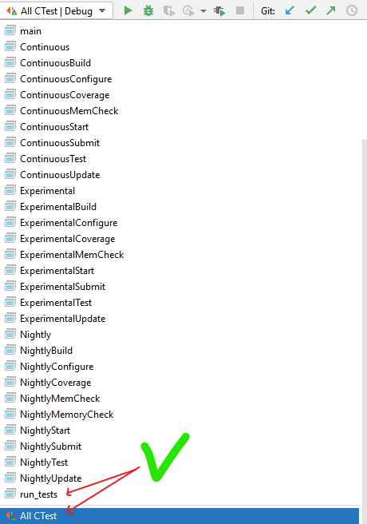

# Домашнее задание по основам C++

## ФИО студента

**Пожалуйста, добавьте сюда свое ФИО**

## Описание задания

Вам предоставлены частичные реализации следующих структур:

- ***Author*** - автор книг (поля: полное имя, возраст и биологический пол);
- ***Book*** - книга (поля: название, содержание, авторы, издательство, жанр);
- ***BookStore*** - книжный магазин (поля: название магазина, хранилище книг, размеры хранилища).

Необходимо реализовать следующие функции и методы.

### Author

1. Конструктор от 3 аргументов с инициализацией полей объекта `full_name`, `age` и `sex`. 

### Book

1. Конструктор от 5 аргументов с инициализацией полей объекта `title`, `content`,
   `genre`, `publisher` и `authors`.


2. Метод добавления автора в список авторов книги `bool AddAuhor(const Author&)`. 
    - Необходимо реализовать проверку на наличие дубликатов по имени автора. 
    - При обнаружении автора с одинаковым именем метод не должен добавлять нового автора в
   список авторов и вернуть значение `false`. 
    - При отсутствии дубликатов, новый автор добавляется в **конец** списка и возвращается значение `true`.

### BookStore

1. Функция изменения объема хранилища книг `Status resize_storage(Book *&, int size, int new_capacity)`.

    - Необходимо провести валидацию аргументов и в случае обнаружения некорректных значений вернуть соответствующий
      статус (
      см. перечисление `ResizeStorageStatus`).
    - При успешной валидации аргументов, необходимо выделить новый участок памяти под хранилище нового объема
      (**capacity**).
    - Все элементы из старого хранилища в количестве равном размеру хранилища (**size**) требуется скопировать в новое
      хранилище.
    - Память, выделенная под старое хранилище, необходимо высвободить.
    - При успешном измении объема хранилища требуется вернуть значение `ResizeStorageStatus::SUCCESS`.


2. Конструктор от 1 аргумента с инициализацией полей объекта `name`, `storage_capacity` и выделением памяти под
   хранилище с изначальным объемом `kInitStorageCapacity`.


3. Деструктор.
    - Требуется высвободить память, выделенную под хранилище и установить корректные размеры и объем хранилища.


4. Метод добавления книги в магазин `void AddBook(const Book&)`.
    - Необходимо следить за текущим количеством книг в хранилище и его объемом. В случае, когда кол-во книг сравнялось с
      объемом хранилища, следует увеличить размер хранилища при помощи метода `resize_storage_internal`, передав в него
      аргумент - новый объем хранилища.
    - Советуется увеличивать объем на небольшое значение (например, на значение `kCapacityCoefficient`).
    - В случае возникновения ошибки при изменении размера хранилища, метод должен просто завершиться.
    - Элементы добавляются в конец списка.

Разница между `capacity` и `size`:

- `capacity` - кол-во всех ячеек памяти, выделенных под массив.
- `size` - кол-во элементов в массиве.

```c++
size = 0;
capacity = 3

int arr = new int[capacity]{};  // [nullptr, nullptr, nullptr]

// здесь size = 0, capacity = 3

// добавляем элементы в "конец"
arr[0] = 3;  // здесь size = 1, capacity = 3
arr[1] = 7;  // size = 2, capacity = 3
```

См. подробнее на [StackOverflow](https://stackoverflow.com/questions/6296945/size-vs-capacity-of-a-vector).

## Цели

- Все тесты должны пройти успешно:
    - для этого разрешается вносить изменения только в файлы, указанные в инструкции ниже

- GitHub Actions должен показывать зеленый маркер, сообщая о том, что все тесты пройдены успешно:
    - красный маркер означает, что некоторые (или все) тесты провалились
    - **Совет 1:** можно кликнуть на красный маркер, чтобы узнать какой тест провалился (или почему программа не
      скомпилировалась)
    - **Совет 2:** если результаты тестов не обновляются, то следует сообщить об этом преподавателю

## Инструкции

1. Добавьте свое ФИО в файл `README.md` (файл, который Вы сейчас читаете).
2. Приведите решения к заданиям в файлах:

- [`src/book.cpp`](src/book.cpp)
- [`src/author.cpp`](src/author.cpp)
- [`src/book_store.cpp`](src/book_store.cpp)

**Остальные файлы изменять нельзя!**

Структура проекта:

- [`src`](src) - папка с исходным кодом программы.
- [`include`](include) - папка с заголовочными файлами программы, необходима для предоставления интерфейса (API) для
  тестирования кода.
- [`tests`](tests) - Unit-тесты для проверки работоспособности кода.
- [`contrib`](contrib) - папка со сторонними библиотеками.
- [`CMakeLists.txt`](CMakeLists.txt) - главный файл системы автоматизации сборки проекта.

## Как запустить?

Импортируйте CMake проект в среду разработки (см. инструкции в Google Classroom).

Команада для клонирования репозитория в терминале:

```shell
git clone --recurse-submodules https://github.com/Algorithms-and-Data-Structures-2021/<название репозитория>
```

Для запуска всех тестов запустите исполняемый файл `run_tests`.



Запуск программы также можно осуществить через исполняемый файл `main` (см. на картинке).

## Заметки

- Решения будут оценены лишь в том случае, если программа компилируется:
    - если код не компилируется, то оценочные тесты не будут запущены

- Результирующие баллы высчитываются при каждом новом коммите (до установленного дедлайна)
- Дедлайн установлен в Google Classroom (за дополнительными вопросами обратитесь к преподавателю)
